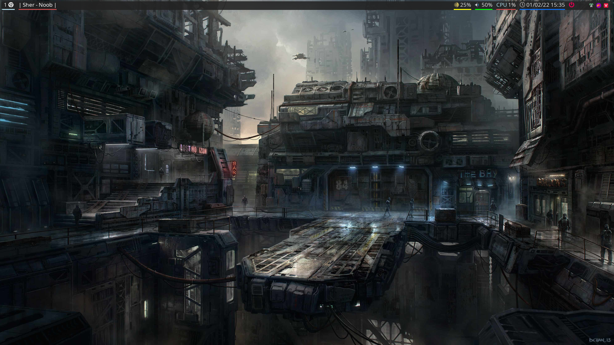
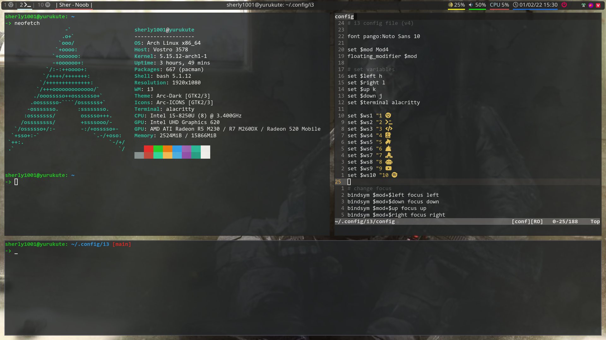
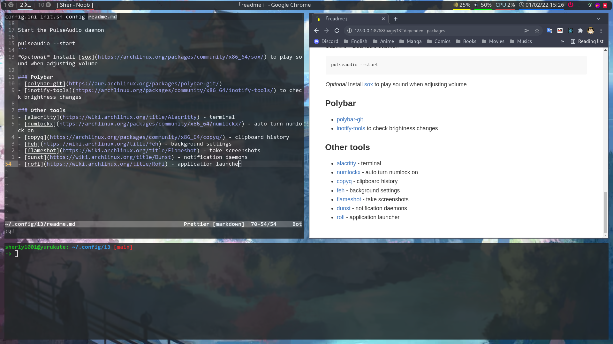
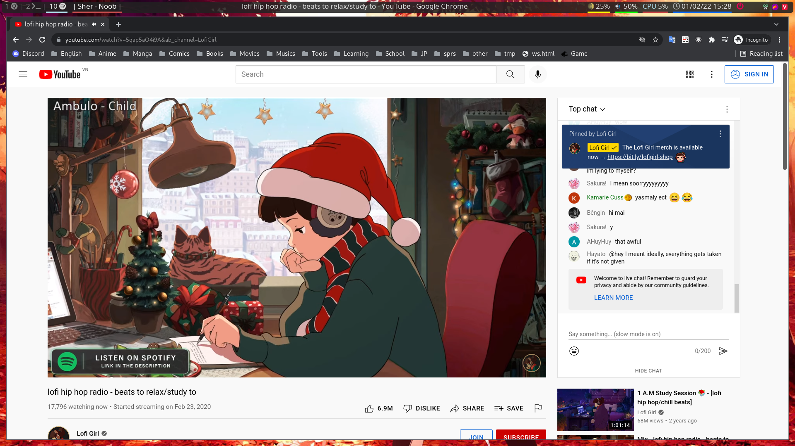

# My i3wm's configures
First goto [dependent packages](#dependent-packages) and download all.
```sh
git clone https://github.com/Sherly1001/i3 ~/.config/i3
cd ~/.config/i3
./scripts/init.sh
```

## Screenshots





## Dependent packages
### Fonts
- [consolas-font](https://aur.archlinux.org/packages/consolas-font)
- [ttf-joypixels](https://www.archlinux.org/packages/community/any/ttf-joypixels)
- [ttf-font-awesome](https://www.archlinux.org/packages/community/any/ttf-font-awesome/)
- [noto-fonts](https://www.archlinux.org/packages/extra/any/noto-fonts)

### Lightdm
Install [lightdm](https://wiki.archlinux.org/title/LightDM) and [lightdm-webkit2-greeter](https://archlinux.org/packages/community/x86_64/lightdm-webkit2-greeter/)

Add the following line to `/etc/lightdm/lightdm.conf` at `[Seat:*]` session
```
greeter-session=lightdm-webkit2-greeter
```
Install [lightdm-webkit-theme-aether](https://github.com/NoiSek/Aether) for eather theme

### Picom
Install [picom-jonaburg-git](https://aur.archlinux.org/packages/picom-jonaburg-git/) from AUR

### Volume
- [alsa-utils](https://archlinux.org/packages/extra/x86_64/alsa-utils/)
- [alsa-plugins](https://archlinux.org/packages/extra/x86_64/alsa-plugins/)
- [pulseaudio-alsa](https://archlinux.org/packages/extra/x86_64/pulseaudio-alsa/)
- [pavucontrol](https://archlinux.org/packages/extra/x86_64/pavucontrol/)

Start the PulseAudio daemon
```
pulseaudio --start
```
*Optional* Install [sox](https://archlinux.org/packages/community/x86_64/sox/) to play sound when adjusting volume

### Polybar
- [polybar-git](https://aur.archlinux.org/packages/polybar-git/)
- [inotify-tools](https://archlinux.org/packages/community/x86_64/inotify-tools/) to check brightness changes

### Other tools
- [alacritty](https://wiki.archlinux.org/title/Alacritty) - terminal
- [numlockx](https://archlinux.org/packages/community/x86_64/numlockx/) - auto turn numlock on
- [copyq](https://archlinux.org/packages/community/x86_64/copyq/) - clipboard history
- [feh](https://wiki.archlinux.org/title/feh) - background settings
- [flameshot](https://wiki.archlinux.org/title/Flameshot) - take screenshots
- [dunst](https://wiki.archlinux.org/title/Dunst) - notification daemons
- [rofi](https://wiki.archlinux.org/title/Rofi) - application launcher
